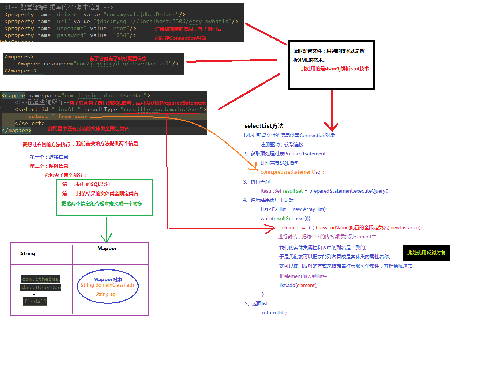

# mybatis-learning
学习mybatis

### 三层框架和SSM的对应关系

* 框架：软件开发的一套解决方案，一个半成品软件。
* 三层架构
  * 表现层：展示数据   **Spring MVC**
  * 业务层：处理业务需求的
  * 持久层：负责数据库交互的  **mybatis**

**********************

### jdbc操作数据库问题分析

* jdbc技术   **规范**
  * Connection
  * PreparedStatement
  * ResultSet

* Spring的JdbcTemplate：spring对jdbc的简单封装   **工具类**
* Apach的DBUtils：也是对jdbc的简单封装  **工具类**
* 上面三种都不够细致方便，因此有了**mybatis**框架

****************************

### mybatis概述

* java的持久层框架
* 封装了jdbc
* 使开发者只关注SQL语句本身
* 通过xml或注解配置Statement
* **ORM**：对象关系映射
  * 把数据库的表与实体类和实体类的属性关联起来
  * 通过操作实体类来操作数据库表

***************

### mybatis环境搭建

* 在IDEA中创建一个maven项目
* 在数据库中导入一张user表
  
* 
  
* 设置maven打包方式`<packaging>jar</packaging>`

* 导入依赖

  ```java
  //mybatis依赖
  <dependency>
      <groupId>org.mybatis</groupId>
      <artifactId>mybatis</artifactId>
      <version>3.4.5</version>
  </dependency>
  //mysql依赖
  <dependency>
      <groupId>mysql</groupId>
      <artifactId>mysql-connector-java</artifactId>
      <version>5.1.6</version>
  </dependency>
  //单元测试依赖
  <dependency>
      <groupId>junit</groupId>
      <artifactId>junit</artifactId>
      <version>4.10</version>
  </dependency>
  //日志依赖
  <dependency>
      <groupId>log4j</groupId>
      <artifactId>log4j</artifactId>
      <version>1.2.12</version>
  </dependency>
  ```

* 在**domain**包下创建**User**类，**实现Serializable接口**，属性名与数据库属性名相同

  ```java
  private Integer id;
  private String username;
  private Date birthday;
  private String sex;
  private String address;
  ```

* 在**dao**包下创建接口**IUserDao**

  ```java
  public interface IUserDao {
      List<User> findAll();
  }在resource文件夹下面
  ```

* 在resource文件夹下面创建**mybatis主配置文件 SqlMapConfig.xml**

  ```xml-dtd
  <?xml version="1.0" encoding="UTF-8"?>
  <!DOCTYPE configuration
          PUBLIC "-//mybatis.org//DTD Config 3.0//EN"
          "http://mybatis.org/dtd/mybatis-3-config.dtd">
  <configuration>
      <environments default="mysql">
          <environment id="mysql">
              <transactionManager type="JDBC"></transactionManager>
              <dataSource type="POOLED">
                  <property name="driver" value="com.mysql.jdbc.Driver"/>
                  <property name="url" value="jdbc:mysql://localhost:3306/day0526-mybatis?useUnicode=true&amp;characterEncoding=utf8"/>
                  <property name="username" value="root"/>
                  <property name="password" value="542270191MSzyl"/>
              </dataSource>
          </environment>
      </environments>
  
      <mappers>
          <mapper resource="dao/IUserDao.xml"/>
      </mappers>
  </configuration>
  ```

* 在resource文件夹下面创建dao包，在创建**映射配置文件 IUserDao。xml**

  ```xml-dtd
  <?xml version="1.0" encoding="UTF-8"?>
  <!DOCTYPE mapper
          PUBLIC "-//mybatis.org//DTD Mapper 3.0//EN"
          "http://mybatis.org/dtd/mybatis-3-mapper.dtd">
  <!-- namespace必须是全类名-->
  <mapper namespace="dao.IUserDao" >
      <!--id必须和方法名相同-->
      <select id="findAll" resultType="domain.User">
          select * from user
      </select>
  </mapper>
  ```

**************

### 环境搭建注意事项

* mybatis映射配置文件位置必须和dao接口的包目录结构相同
* 保证全类名和方法名统一就可以不写实现层只写接口

****************

### mybatis入门遇见的bug
* 无效的源发行版12
  
  * 把编译版本改成8
* 提示说找不到IUserDao的映射

  * 原来是没在SqlMapConfig.xml下写

    `<mappers>
            <mapper resource="dao/IUserDao.xml"/>
    </mappers>`

* 提示`Unknown initial character set index '255' received from server. Initial client character`
  
  * 改成`jdbc:mysql://localhost:3306/day0526-mybatis?useUnicode=true&amp;characterEncoding=utf8`

*****************

### mybatis 入门案例步骤

* ```java
  //读取配置文件
  InputStream is= Resources.getResourceAsStream("SqlMapConfig.xml");
  //创建工厂
  SqlSessionFactoryBuilder builder=new SqlSessionFactoryBuilder();
  SqlSessionFactory factory=builder.build(is);
  //使用工厂生产对象
  SqlSession sqlSession = factory.openSession();
  //创建dao接口的代理对象
  IUserDao userDao= sqlSession.getMapper(IUserDao.class);
  //用代理对象执行方法
  List<User> users = userDao.findAll();
  for (User user:users) {
      System.out.println(user);
  }
  //释放资源
  is.close();
  sqlSession.close();
  ```
*****************************

### 基于注解的mybatis案例

* 删除resource下dao包全部内容

* 在IUserDao的findAll方法上添加注解

  ```java
  @Select("select * from user")
  List<User> findAll();
  ```

* 在SqlMapConfig.xml中修改mappers内容

  ```xml
  <mappers>
      <mapper class="dao.IUserDao"/>
  </mappers>
  ```

* 自己的总结

  * mybatis就是通过定位mapper来实现功能，没有注解是通过namespace确定那个类，id确定方法

    * ```xml
      <mapper namespace="dao.IUserDao" >
          <select id="findAll" resultType="domain.User">
              select * from user
          </select>
      </mapper>
      ```
  *  注解和xml都要在SqlMapConfig.xml里面定义mappers，这才是核心

**************************

### 入门案例中的设计模式分析

* 读取文件只有两种方式靠谱
  * 使用类加载器，但是它只能读类路径下的文件
  
  * 使用ServerletContext对象的getRealPath()方法
  
  * ```java
    //读取配置文件
    InputStream is= Resources.getResourceAsStream("SqlMapConfig.xml");
    ```
* 工厂创建使用了**构造者模式**，**builder**是构建者

  * ```java
    //创建工厂
    SqlSessionFactoryBuilder builder=new SqlSessionFactoryBuilder();
    SqlSessionFactory factory=builder.build(is);
    ```

* 创建IUserDao使用了**代理者模式**，可以不修改源码的基础上对已有方法增强

  * ```java
    //创建dao接口的代理对象
    IUserDao userDao= sqlSession.getMapper(IUserDao.class);
    ```

    

**************************

### 入门案例原理分析

* 三个xml与jdbc的关系



* 代理分析


*******************************

### mybatis实现过程

* 第一步：SqlSessionFactoryBuilder对象接收SqlMapConfig.xml文件流，创建SqlSessionFactory对象
* 第二步：SqlSessionFactory对象读取SqlMapConfig.xml中的数据库连接信息和mapper映射信息，创建出真正操作数据库的对象SqlSession
* 第三步：SqlSession可以生成代理对象
  * 其中涉及Connection对象
  * 其中还涉及要执行的SQL语句
* 第四步：把返回对象封装成结果集，返回给调用者

************************

### mybatis的CRUD

* 基于xml配置的添加

  * IUserDao接口定义`void saveUser(User user);`方法

  * SqlSessionConfig.xml中之前已经配置了mapper，不用配置

  * 在IUserDao.xml中配置saveUser(User user)的方法

    * ```xml
      <insert id="saveUser" parameterType="domain.User">
          insert into user (username,birthday,sex,address)values (#{username},#{birthday},#{sex},#{address})
      </insert>
      ```
    
  * 测试方法最后一定要手动提交事务
  
    * ```java
      User user=new User();
      user.setUsername("王也");
      user.setBirthday(new Date());
      user.setAddress("武当");
      user.setSex("男");
      userDao.saveUser(user);
      sqlSession.comit();
      ```
    
   * 使用Junit测试框架**@Before  @After**简化代码如下
  
     * ```java
       private InputStream is=null;
       private SqlSessionFactoryBuilder builder=new SqlSessionFactoryBuilder();
       private SqlSession sqlSession=null;
       private IUserDao userDao=null;
       
       @Before
       public void init() throws IOException{
           is=Resources.getResourceAsStream("SqlMapConfig.xml");
           sqlSession=builder.build(is).openSession();
           userDao=sqlSession.getMapper(IUserDao.class);
       }
       
       @After
       public void destroy() throws IOException {
           is.close();
           sqlSession.close();
       }
       ```
  
* 基于xml的修改

  * 总体和上面相同

  * IUserDao中的SQL语句如下

    * ```xml
      <update id="updateUser" parameterType="domain.User">
          update user set username=#{username},birthday=#{birthday},sex=#{sex},address=#{address} where id=#{id}
      </update>
      ```
    
  * 逻辑是根据唯一自增长的id进行修改，但也可以自定义
  
* 基于xml的删除

  * IUserDao中的SQL语句如下

    * ```xml
      <delete id="deleteUser" parameterType="java.lang.Integer">
          delete from user where id=#{id}
      </delete>
      ```
  
* 基于xml的查询（查询一个）

  * 这次参数和返回都要设置类型，两者都有

    * ```xml
      <select id="findById" parameterType="java.lang.Integer" resultType="domain.User">
          select * from user where id=#{id}
      </select>
      ```
  
* 基于xml的模糊查询

  * 重点是参数的形式，在传参时加入**%**模糊符号。

    * ```xml
      <select id="findByName" parameterType="java.lang.String" resultType="domain.User">
          select * from user where username like #{username}
      </select>
      ```
   * 其中参数为**%王%**
  
* 获取添加的key值

  * ```xml
    <insert id="saveUser" parameterType="domain.User">
        <selectKey keyProperty="id" keyColumn="id" resultType="java.lang.Integer" order="AFTER">
            select last_insert_id()
        </selectKey>
        insert into user (username,birthday,sex,address)values (#{username},#{birthday},#{sex},#{address})
    </insert>
    ```
    
  * 其中keyProperty对应实体类的属性id，keycolum对应数据库表的列名，resulttype对应返回的类型，order表示insert前还是后
  
  * 打印要在commit之前，保存之后。
  
    * ```java
      userDao.saveUser(user);
      System.out.println(user.getId());
      sqlSession.commit();
      ```
************************
### mybatis中SQL参数深入理解

* OGNL表达式
  * 释义：对象图导航语言
  * 作用：通过对象的取值方法获取数据，写法上把get给省略了
    * 比如：user.getName() -> user.name
  * 在mybatis中连user都可以省略，直接**name**
  * 完整写法举例： 在TestClass类中有一个属性是private User user;现在想以这个user的username来进行模糊查询
    * `parameterType="domain.TestClass"`
    * select * from user where username like #{**user.username**}    user是参数类型类的一个属性，点后面是属性的属性
    * 这个知识点可以用来做多限定模糊查询

********************

### mybatis中结果封装

* 当实体类的属性名和数据库表的列名不匹配时

  * SQL参数：因为是从实体类中获取值作为SQL的参数，因此只用根据OGNL规则修改**#{}**内参数就行

  * 封装值为null

    * 起别名：`select id as userId,name as userName …… from user` 把数据库表的列名改成实体类属性名

    * 在mapper标签下加入映射关系

      ```xml
      <resultMap id="userMap" type="domain.User">
          <id property="userId" column="id"></id>
          <result property="userName" column="username"></result>
          <result property="userBirthday" column="birthday"></result>
          <result property="userSex" column="sex"></result>
      </resultMap>
      ```
      * id值随便取
      * 使用的时候不能用resultType, 而是用**resultMap="i上面的d值"**
      * 这种性能低，但只用写一次

****************************

### SqlMapConfig.xml中的数据库连接property信息和typeAlias配置

* 可以从外部引入property文件作为配置信息

  * ```xml
    <configuration>
        <properties resource="jdbcConfig.property"></properties>
        
        <environments default="mysql">
            <environment id="mysql">
                <transactionManager type="JDBC"></transactionManager>
                <dataSource type="POOLED">
                    <property name="driver" value="${jdbc.driver}"/>
                    <property name="url" value="${jdbc.url}"/>
                    <property name="username" value="${jdbc.username}"/>
                    <property name="password" value="${jdbc.password}"/>
                </dataSource>
            </environment>
        </environments>
    
        <mappers>
            <mapper resource="dao/IUserDao.xml"/>
        </mappers>
    </configuration>
    ```
    
  * <properties>标签下的resource属性值是配置文件所在的路径
  
  * <property>标签中的value值为**&{配置文件中的完整键名}**
  
* typeAlias可以简化不用每次参数和返回类型都写全限定类名

  * 在<configuration>标签下写

    * ```xml
      <typeAliases>
      	<typeAlias type="domain.User" value="user"></typeAlias>
      </typeAliases>
      ```
    * type属性是全类名(按规矩写，不能写错)，value属性是方便使用的类名(名字随便取)

**************
### mybatis中的连接池

* 概念：连接池是一个队列，里面存放连接池对象。且这个队列必须保证线程安全。
* 配置位置：SqlMapConfig.xml下的<dataSource>标签
* <dataSource>标签的type属性

  * POOLED —— 采用javax.sql.DataSource规范中的连接池，mybatis中有其实现

  * UNPLLOED —— 采用传统获取连接池的方法，虽然也实现了javax.sql.DataSource接口，但是没有使用池的思想
  * JNID —— 采用服务器的JNID实现来获取DataSource对象，不同服务器拿到的datasource对象不同
    * 注意：仅限于web和maven的war工程使用
    * 本次课程采用的是Tomcat服务器，用dbcp连接池
* POOLED使用 原理
  * 看连接池有无空间的连接可以用，有就直接取第一个来用，没有就执行下一步
  * 看连接池总共已经创建出的连接池数量是否小于连接池数量上限，小于就创建一个出来直接使用，没有就执行下一步
  * 从使用池子里面取最老使用最久的一个连接，删除其相关属性，用来使用。 —— 这样可以防止占用一个连接太久

**************************

### mybatis的事务

* 实现机制：通过SqlSession对象的commit() 和rollback() 方法来实现提交和回滚

*************
### mybatis的动态SQL语句查询

* 动态查询示例

  * ```xml
    <select id="findByParameterDynamic" parameterType="domain.User" resultType="domain.User">
        select * from user where 1=1
        <if test="userName != null">and username=#{userName}</if>
        <if test="birthday != null">and birthday=#{birthday}</if>
        <if test="sex != null">and sex=#{sex}</if>
        <if test="address != null">and address=#{address}</if>
    </select>
    ```

  * 注意事项

    * 前面有一个**1=1**，是为了统一加**and**

    * 涉及数据库表列名可以不区分大小写（仅仅是因为Windows系统下mysql不区分大小写，Linux下要区分）；涉及获取javaBean中的属性时严格区分大小写。

* where标签使用示例

  * ```xml
    select * from user
    <where>
        <if test="userName != null">and username=#{userName}</if>
        <if test="birthday != null">and birthday=#{birthday}</if>
        <if test="sex != null">and sex=#{sex}</if>
        <if test="address != null">and address=#{address}</if>
    </where>
    ```

    * 就是把**1=1**去掉了，**and**照样加
  
* foreach标签使用案例

  * ```xml
    <select id="findUserInIds" resultMap="userMap" parameterType="queryvo">
        <include refid="defaultUser"></include>
        <where>
            <if test="ids != null and ids.size()>0">
                <foreach collection="ids" open="and id in (" close=")" item="uid" separator=",">
                    #{uid}
                </foreach>
            </if>
        </where>
    </select>
    ```
    
  * 注意事项
    
    * 完全就是字符串拼接，没啥技术含量
    * 最后SQL语句是`select * from user where id in (41,42,43)`
**************
### mybatis中的多表查询

* 表之间的关系
  * 一对一 —— 人与身份证号
  * 一对多 —— 用户与订单
  * 多对多 —— 学生与老师
  * 特例 ：mybatis中认为多对一为一对一。比如订单与用户关系为多对一，但拿出一个订单只有一个用户，为一对一
  
* 通过继承的方式实现多表查询

  * 首先通过**继承**的方式创建AccountUser类

    * ```java
      public class AccountUser extends Account {
          private String userName;
          private String address;
      }
      ```
    
  * 在接口中定义查询方法，List泛型为AccountUser
  
  * 配置IAccountUserDao.xml文件
  
    * ```xml
      <select id="findAllAccountUser" resultType="domain.AccountUser">
          select account.*,user.username,user.address from account account,user user where account.UID=user.id
      </select>
      ```
      
    * 注意SQL语句的写法
    
    * 因为Linux下要区分表名的大小写，因此最好做一次映射，区分表名大小和实体类小写如下
    
      ```xml
      <resultMap id="findAllMap" type="domain.Account">
          <id property="id" column="ID" />
          <result property="uid" column="UID" />
          <result property="money" column="MONEY" />
      </resultMap>
      ```
  
* 通过建立实体类间的耦合关联来实现多表查询

  * 在Account类中添加**user属性**，并为user属性设置get和set方法

  * 配置**resultMap**映射

    ```xml
    <resultMap id="findAccountWithUserPropertyMap" type="domain.AccountWithUserProperty">
        <id property="id" column="ID" />
        <result property="uid" column="UID" />
        <result property="money" column="MONEY" />
        <association property="user" column="UID" javaType="domain.User">
            <id property="id" column="id" />
            <result property="userName" column="username" />
            <result property="sex" column="sex"/>
            <result property="birthday" column="birthday" />
            <result property="address" column="address" />
        </association>
    </resultMap>
    ```

    * <association>标签和javaType属性
    
  * ```xml
    <select id="findAccountWithUserProperty" resultMap="findAccountWithUserPropertyMap">
        select account.*,user.id,user.address from account account,user user where account.UID=user.id
    </select>
    ```
  
* 通过建设实体类联系的一对多查询

  * 在User类中添加List<Account> accounts属性

  * 配置resultMap

    ```xml
    <resultMap id="findByIdMap" type="domain.User">
        <id property="id" column="id"/>
        <result property="userName" column="username" />
        <result property="birthday" column="birthday" />
        <result property="address" column="address" />
        <result property="sex" column="sex" />
        <collection property="accounts" column="UID" ofType="domain.Account">
            <id property="id" column="accountid" />
            <result property="uid" column="UID" />
            <result property="money" column="MONEY" />
        </collection>
    </resultMap>
    ```

    * 注：account和user两张表都有属性id，且不区分大小写，因此其中一个必须重命名做区分

    * <collection>和ofType属性

  * ```xml
    <select id="findAll"  resultMap="findByIdMap">
            select user.*,account.id as accountid,account.* from user user left outer join account account on user.id=account.UID
    </select>
    ```
  
    * 注意外连接的使用`left outer join …… on`
  
* 多对多查询

  * 首先需要创建一张**中间表**，中间表只有两列，分别是两张表的主键

  * 然后每一个实体类中都有另外一个实体类属性的引用

  * 借助中间表进行两次外连接查询，逻辑如下

    
    
  * SQL语句太长，换行回车之前都要加个**空格**，防止最后拼接错误
  
  * SQL写法
  
    * ```sql
      select user.*,role.*,role.id=role id  
      from user user left outer join user_role user_role  
      on user.id=user_role.uid  
      left outer join role role  
      on user_role.uid=role.id
      ```
  * 还是使用<Collection>和ofType属性
***********************
###  mybatis延迟加载和立即加载

* 概念：
  * 延迟加载：真正使用数据时才查询，不用时不查询。也叫按需加载（懒加载）。如：一个用户对应100个账户，先不查，用时在查。
  * 立即加载： 不管用不用，只要一调用就马上加载。
  
* 一对多延迟加载的实现

  * 核心逻辑 ：在需要使用时调用另外实体类的配置文件实现查询

  * 第一步：dao层接口方法定义

    * ```java
      public interface IAccountDao {
          List<Account> findAll();
          List<Account> findByUId(Integer uId);//一定是根据UID来查询，不是根据ID查询
      }
      
      public interface IUserDao {
          List<User> findAll();
      }
      ```
    * 注意 ：参数是UID不是ID；返回的是集合不是单个对象，因为一个User有多个对象
    
  * 第二步：xml配置实现
  
    * 重点 ：user查询所有方法配置
  
      ```xml
      <resultMap id="findAllMap" type="domain.User">
          <id property="id" column="id"/>
          <result property="userName" column="username" />
          <result property="birthday" column="birthday" />
          <result property="address" column="address" />
          <result property="sex" column="sex" />
          <collection property="accounts" column="id" ofType="domain.Account" select="dao.IAccountDao.findByUId" />
      </resultMap>
      
      <select id="findAll"  resultMap="findAllMap">
          select * from user
      </select>
      ```
      * <collection>标签的子标签内容不用写了
      * column属性的内容非常重要。此时"id"指user的id，在account表中为"UID"，**作为参数**
      * select属性内容是全限定方法名
    
  * 第三步 ：配置SqlMapConfig.xml中的设置
  
    * ```xml
      <configuration>
          <settings>
              <setting name="lazyLoadingEnabled" value="true"/>//开启全局懒加载
              <setting name="aggressiveLazyLoading" value="false"/>//关闭暴力懒加载
          </settings>
      </configuration>
      ```
  
   * 第四步： 测试的时候不要打印Account内容，只打印user内容，就可以发现account查询还没执行。

***********************

### mybatis中的缓存

* 概念：存放在内存中经常查询且不容改变的数据
* 一级缓存 ：是SqlSession对象的一块区域，数据结构为Map
  * 使用 ： mybatis底层已经实现，只有SqlSession对象调用**close()和clearCache()**方法时会清空缓存	
* 二级缓存 ：由同一个SqlSessionFactory创建的所有SqlSession对象共享